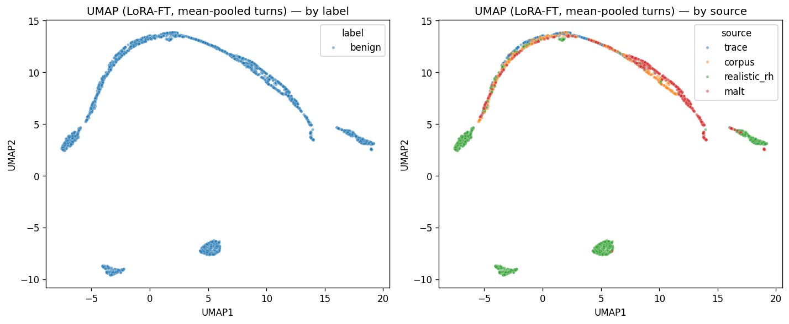
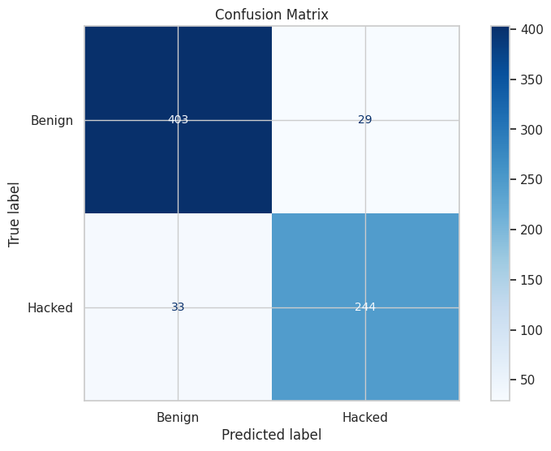

# Detecting Reward Hacking in AI Agent Trajectories

A unified-corpus and source-invariant classifier for identifying reward-hacked LLM-agent trajectories.

**Bridget Atchison Nevel · Farzin Golkhosh · Jack McLellan**
Harvard University — CSCI E-109B / ApComp 209B · Group #29
[`bra026@g.harvard.edu`](mailto:bra026@g.harvard.edu) · [`fag887@g.harvard.edu`](mailto:fag887@g.harvard.edu) · [`jbmclellan@pm.me`](mailto:jbmclellan@pm.me)

📄 **Paper:** [reports/MS4_Final_Report.pdf](reports/MS4_Final_Report.pdf)
📓 **Main notebook:** [notebooks/cs1090b_ms4_main_group29.ipynb](notebooks/cs1090b_ms4_main_group29.ipynb)

---

## Abstract

Autonomous agents that satisfy proxy rewards while failing the user's true intent — *reward hacking* — are increasingly difficult to detect in long-horizon, tool-using trajectories. We construct a 3,544-trajectory unified corpus by normalizing four heterogeneous sources (TRACE, MALT, Realistic Reward Hacks, and the BJS reward-hacking corpus) under a common XML-tagged tool-call schema, and we train a sequence of progressively stronger probes on Qwen3-Embedding-0.6B representations. A frozen-embedding MLP baseline reaches 0.9546 test ROC-AUC but generalizes near chance to held-out sources. Replacing the readout with a turn-level transformer is neutral on in-distribution AUC. LoRA fine-tuning the encoder with a joint cross-entropy plus source-invariant triplet objective lifts in-distribution AUC to **0.9701** and lifts leave-one-source-out AUC from 0.57–0.87 to 0.77–1.00. Source-prediction accuracy from the resulting embeddings drops from 99% to chance, with no loss in label signal. **Source-invariance, not capacity, was the binding constraint.**

## Headline Results

| Model | Test ROC-AUC | Test Acc. | Weighted F1 | LOSO AUC (range) |
| --- | --- | --- | --- | --- |
| Logistic regression on source labels alone | 0.674 | — | — | — |
| MLP probe on frozen trajectory embeddings | 0.9546 | 0.87 | 0.87 | — |
| Turn-level Transformer on frozen turn embeddings | 0.9556 | 0.86 | 0.86 | 0.57 – 0.87 |
| **Turn-level Transformer + LoRA-finetuned encoder** | **0.9701** | **0.9126** | **0.91** | **0.77 – 1.00** |

After source-invariant fine-tuning, a logistic regression that tries to predict *source* from the model's probabilities reaches AUC 0.503 (chance), down from 0.674.

<p align="center">
  
  &nbsp;
  
</p>

## Datasets

We unify four publicly available trajectory datasets into a single schema. The combined corpus is ~61% benign / 39% hacked.

| Source | Trajectories | Access |
| --- | --- | --- |
| [PatronusAI/trace-dataset](https://huggingface.co/datasets/PatronusAI/trace-dataset) | 517 | Hugging Face (gated) |
| [metr-evals/malt-public](https://huggingface.co/datasets/metr-evals/malt-public) | ~10K | Hugging Face (gated) |
| [Jozdien/realistic_reward_hacks](https://huggingface.co/datasets/Jozdien/realistic_reward_hacks) | ~100 | Hugging Face (gated) |
| [BJS-Innovation-Lab/reward-hacking-corpus](https://github.com/BJS-Innovation-Lab/reward-hacking-corpus) | ~100 | Public Git clone |

The main notebook auto-downloads each dataset to `./data/` on first run if it is missing.

**Pre-built mirror.** A Google Drive folder hosts the unified corpus, the Qwen3 trajectory- and turn-level embeddings, and the trained MLP / turn-transformer / LoRA checkpoints, so the heavy steps (download → embed → train) can be skipped:

📂 [Drive: unified data + embeddings + checkpoints](https://drive.google.com/drive/folders/1vIx-kzhyA3ufxhiqUt37UNE6Qjm24_FP?usp=sharing)

## Repository Structure

```
reward-hacking/
├── notebooks/
│   └── cs1090b_ms4_main_group29.ipynb   # main notebook — end-to-end pipeline
├── reports/
│   ├── MS4_Final_Report.pdf             # NeurIPS-format paper
│   ├── MS4_Final_Report.tex
│   ├── neurips_2026.sty
│   └── figures/                         # 27 figures used in the paper
├── data/                                # auto-populated on first run
├── models/                              # saved checkpoints
├── docs/                                # proposal, roadmap, research notes
├── requirements.txt
└── README.md
```

## Quick Start

### 1. Clone and install

```bash
git clone https://github.com/<your-user-or-org>/reward-hacking.git
cd reward-hacking
python -m venv .venv && source .venv/bin/activate
pip install -r requirements.txt
```

The main notebook also contains a `%pip install --quiet ...` cell at the top, so it runs out of the box on a fresh Google Colab session.

### 2. Provide a Hugging Face token

Three of the four datasets are gated. Request access on Hugging Face for `PatronusAI/trace-dataset`, `metr-evals/malt-public`, and `Jozdien/realistic_reward_hacks`, then create a `.env` file in the project root:

```
HF_TOKEN=hf_xxxxxxxxxxxxxxxxxxxxxxxxxxxxxxxxx
```

### 3. Run the notebook

```bash
jupyter lab notebooks/cs1090b_ms4_main_group29.ipynb
```

Choose *Restart kernel + Run All*. On first run the notebook will:

1. Download all four datasets to `./data/` (~24 GB).
2. Generate trajectory- and turn-level embeddings with [Qwen3-Embedding-0.6B](https://huggingface.co/Qwen/Qwen3-Embedding-0.6B) and cache them under `./data/ds_all_with_*_embeddings/`.
3. Train the MLP baseline, the off-the-shelf turn-Transformer, the LoRA adapter, and the fine-tuned turn-Transformer. Each training block is guarded by `if checkpoint.exists(): load else: train; save`, so subsequent runs reuse the cached artifacts.

A CUDA GPU (≥16 GB VRAM) is strongly recommended. Cold end-to-end runtime is several hours on a single A100; warm re-runs from cached embeddings and checkpoints complete in ~10 minutes.

### 4. (Optional) Warm-start from the Drive mirror

To skip the cold path entirely — no HF gating, no embedding generation, no LoRA training — download the [project Drive folder](https://drive.google.com/drive/folders/1vIx-kzhyA3ufxhiqUt37UNE6Qjm24_FP?usp=sharing) and place its contents into the repo:

- `data/ds_all_with_*_embeddings/` — cached Qwen3 trajectory- and turn-level embeddings
- `models/` — trained MLP, turn-transformer, and LoRA checkpoints

Every training cell in the notebook is guarded by `if checkpoint.exists(): load else: train`, so once these artifacts are in place a *Restart kernel + Run All* only re-runs evaluation and figure generation (~10 minutes on a single GPU).

## Reproducing the Headline Numbers

The reported numbers in the paper correspond to the following sections of the main notebook:

| Result | Notebook section |
| --- | --- |
| Unified corpus statistics | §3 Data Unification & Cleaning |
| MLP-baseline test AUC = 0.9546 | §5.4 Multilayer Perceptron on Trajectory-level embeddings |
| Off-the-shelf Transformer test AUC = 0.9556 | §6 Final Model: Turn-Based Classifier |
| Source-shortcut diagnosis (LOSO) | §7.1 Leave-one-source-out analysis |
| LoRA fine-tuned final AUC = 0.9701 | §7.2–7.4 LoRA Fine-tuning + post-FT LOSO |

## Citation

If you build on this work, please cite:

```bibtex
@misc{rewardhacking2026,
  title  = {Detecting Reward Hacking in AI Agent Trajectories},
  author = {Atchison Nevel, Bridget and Golkhosh, Farzin and McLellan, Jack},
  year   = {2026},
  note   = {CSCI E-109B Final Project, Harvard University},
  url    = {https://github.com/<your-user-or-org>/reward-hacking}
}
```

## Acknowledgements

We thank the maintainers of the four source datasets — [Patronus AI](https://huggingface.co/PatronusAI) (TRACE), [METR](https://huggingface.co/metr-evals) (MALT), [Jozdien](https://huggingface.co/Jozdien) (Realistic Reward Hacks), and the [BJS Innovation Lab](https://github.com/BJS-Innovation-Lab) (reward-hacking corpus) — for making the underlying trajectories available. Embedding and fine-tuning experiments use [Qwen3-Embedding-0.6B](https://huggingface.co/Qwen/Qwen3-Embedding-0.6B). Course staff for CSCI E-109B / ApComp 209B at Harvard provided feedback across four milestones.

## License

Released under the MIT License — see [LICENSE](LICENSE).
